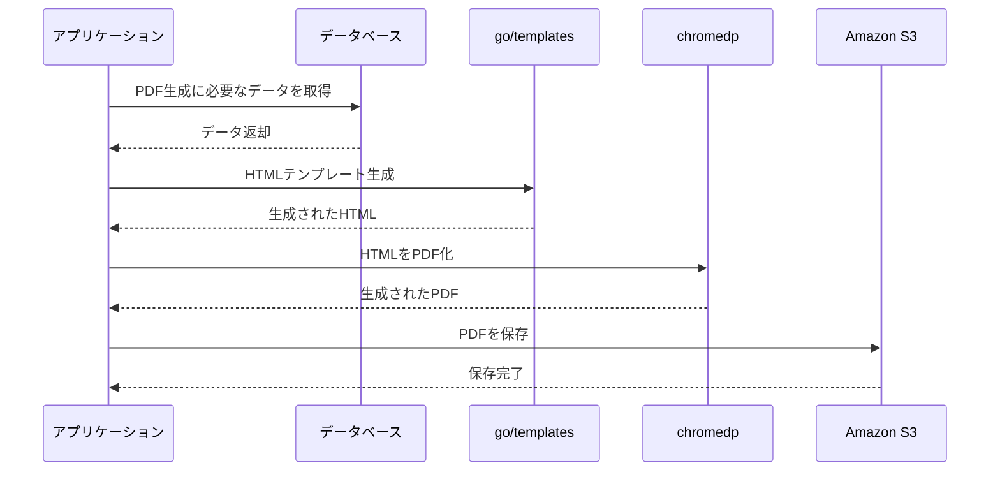

:::message

この記事は[スターフェスティバル Advent Calendar 2025](https://qiita.com/advent-calendar/2025/stafes)の17日目の記事です。
:::

# はじめに
こんにちは、スターフェスティバルのtakataです。

今、私は社内DXの一環として紙で出力していた書類を電子化しPDFとして保存しメール送信を行うプロダクトを開発しています。

開発当初の段階ではメール送信ではなくリクエストがあったタイミングで書類を発行しダウンロードしてもらう想定だったため、シンプルに逐次実行を行うような処理を実装していました。
ところが、開発途中で特定の時間にバッチ処理でメールに添付して送信をすることになり、そうすると実行時間がネックになることがわかりました。

具体的には1000件ほどのデータに対して25分程度かかっている状態になっており、繁忙期などを考えると少し不安が残る結果となっていました。

そこでこのプロダクトはGoで実装していたのでgoroutineを使ってサクッと並列化できるのでは？という考えから並列化を進めてみることにしました。

# 並列化に必要な知識

ここではGoで並列処理を実装するために必要な基本的な知識を紹介します。

## goroutine

goroutineはGoにおける軽量なスレッドのようなもので、並行処理を簡単に実現するための仕組みです。

https://go.dev/doc/effective_go#goroutines

通常のスレッドと比較して以下のような特徴があります。

- **軽量**: 1つのgoroutineは約2KBのスタックメモリから開始され、必要に応じて動的に拡張されます。OSスレッドが数MBのスタックを必要とするのに比べて非常に軽量です。
- **起動が簡単**: 関数呼び出しの前に`go`キーワードをつけるだけで起動できます。
- **Goランタイムによる管理**: goroutineはGoランタイムのスケジューラによって管理され、OSスレッドへ効率的にマッピングされます。

基本的な使い方は以下のとおりです。

```go
func main() {
    // goキーワードをつけるだけでgoroutineとして実行される
    go  HogeHuga()

    // 無名関数も使える
    go func() {
        fmt.Println("Hello from goroutine")
    }()
}
```

ただし、goroutineを起動しただけでは、メインの処理が終了するとgoroutineも終了してしまいます。そのため、goroutineの完了を待つには`sync.WaitGroup`を使用するのが一般的です。

```go
func main() {
    var wg sync.WaitGroup

    for i := 0; i < 10; i++ {
        wg.Add(1) // カウンタを増やす
        go func(n int) {
            defer wg.Done() // 処理完了時にカウンタを減らす
            fmt.Printf("goroutine %d\n", n)
        }(i)
    }

    wg.Wait() // すべてのgoroutineが完了するまで待機
}
```

このように、Goでは非常に簡単に並行処理を記述できるようになっています。

## チャネル（channel）

goroutineと合わせてよく使われるのがチャネル（channel）です。チャネルはgoroutine間でデータを安全にやり取りするための仕組みで、Goの並行処理における重要な要素です。

https://go.dev/doc/effective_go#channels

Goでは「メモリを共有して通信するのではなく、通信によってメモリを共有する」という設計思想があり、チャネルはこの思想を実現するための機能です。

チャネルの基本的な使い方は以下のとおりです。

```go
func main() {
    // チャネルの作成
    ch := make(chan string)

    go func() {
        // チャネルにデータを送信
        ch <- "Hello from goroutine"
    }()

    // チャネルからデータを受信（受信するまでブロックされる）
    msg := <-ch
    fmt.Println(msg)
}
```

### バッファ付きチャネル

先ほどの例で使用した`make(chan string)`はバッファなしチャネルで、送信と受信が同時に行われる必要があります。一方、`make(chan int, 3)`のように第2引数でバッファサイズを指定すると、バッファ付きチャネルを作成できます。

バッファ付きチャネルでは、バッファに空きがある限り送信側はブロックされません。

```go
func main() {
    // バッファサイズ3のチャネルを作成
    ch := make(chan int, 3)

    // バッファに空きがあるのでブロックされずに送信できる
    ch <- 1
    ch <- 2
    ch <- 3

    // バッファから受信
    fmt.Println(<-ch) // 1
    fmt.Println(<-ch) // 2
    fmt.Println(<-ch) // 3
}
```

ただし、バッファが満杯の状態で送信しようとすると、受信されるまでブロックされます。受信する処理がなければデッドロックが発生するので注意が必要です。

```go
func main() {
    ch := make(chan int, 2)

    ch <- 1
    ch <- 2
    ch <- 3 // バッファが満杯で受信する処理もないためデッドロック！
    // fatal error: all goroutines are asleep - deadlock!
}
```

### チャネルのクローズとrange

チャネルは`close()`でクローズでき、`range`を使ってチャネルが閉じられるまでデータを受信し続けることができます。

```go
func main() {
    ch := make(chan int)

    go func() {
        for i := 0; i < 5; i++ {
            ch <- i
        }
        close(ch) // 送信が完了したらチャネルを閉じる
    }()

    // チャネルが閉じられるまでループ
    for v := range ch {
        fmt.Println(v)
    }
}
```

このように、チャネルを使うことでgoroutine間の通信やデータの受け渡しを安全に行うことができます。

# goroutineによる並列化の実装
ではこれらを踏まえて実際に並列化していきます。
PDF生成は以下のような流れで行われています。



この処理をまるっと並列で動かせるようにします。
コードはこんな感じ(実際のプロダクションコードとは異なります)
```go
type PDFResult struct {
	ID      int
	Success bool
	Error   error
}

func GeneratePDFs(ctx context.Context, ids []int) ([]PDFResult, error) {
	// 結果を格納するチャネル
	resultChan := make(chan PDFResult, len(ids))

	// WaitGroupで並列処理を管理
	var wg sync.WaitGroup

	// セマフォで同時実行数を制限（最大10並列）
	semaphore := make(chan struct{}, 10)

	// 各IDに対して並列処理
	for _, id := range ids {
		wg.Add(1)
		go func(id int) {
			defer wg.Done()

			// セマフォを取得（空のstructを送信）
			semaphore <- struct{}{}
			defer func() { <-semaphore }() // 処理完了後にセマフォを解放

			// 個別処理には30秒のタイムアウトを設定
			processCtx, cancel := context.WithTimeout(ctx, 30*time.Second)
			defer cancel()

			// PDF生成処理を実行
			err := generatePDF(processCtx, id)

			// 結果をチャネルに送信
			resultChan <- PDFResult{
				ID:      id,
				Success: err == nil,
				Error:   err,
			}
		}(id)
	}

	// すべてのgoroutineが完了したらチャネルを閉じる
	go func() {
		wg.Wait()
		close(resultChan)
	}()

	// 結果を収集
	var results []PDFResult
	for result := range resultChan {
		results = append(results, result)
	}

	return results, nil
}

// PDF生成処理
func generatePDF(ctx context.Context, id int) error {
	// 1. データ取得
	data, err := fetchData(ctx, id)
	if err != nil {
		return fmt.Errorf("データ取得エラー: %w", err)
	}

	// 2. HTMLテンプレート生成
	html, err := generateHTML(data)
	if err != nil {
		return fmt.Errorf("HTML生成エラー: %w", err)
	}

	// 3. HTMLをPDF化
	pdf, err := convertHTMLToPDF(ctx, html)
	if err != nil {
		return fmt.Errorf("PDF変換エラー: %w", err)
	}

	// 4. S3に保存
	if err := uploadToS3(ctx, id, pdf); err != nil {
		return fmt.Errorf("S3アップロードエラー: %w", err)
	}

	return nil
}
```

コードの詳細を見ていきます。

- **セマフォによる同時実行数の制限**

    ```go
    semaphore := make(chan struct{}, 10)
    ```

    セマフォは同時に実行されるgoroutineの数を制限するための仕組みです。ここではバッファサイズ10のチャネルを使用して、最大10個のgoroutineまで同時実行できるようにしています。

    ```go
    semaphore <- struct{}{} // セマフォを取得
    defer func() { <-semaphore }() // 処理完了後にセマフォを解放
    ```

    goroutineが処理を開始する前にセマフォを取得し、処理が完了したら解放します。バッファが満杯の場合、`semaphore <- struct{}{}`の部分でブロックされるため、同時実行数が制限されます。

    セマフォを使う理由としては

    - **リソースの保護**
    PDF生成はchromedpを利用しています。バックグラウンドでChrome(Headless)が動いているため、無制限に並列実行するとメモリやCPUなどのシステムリソースが枯渇する可能性があります。
    - **外部サービスへの配慮**
    一部のデータ取得処理では外部のAPIを利用しています。無制限に並列実行すると他システムへの影響も懸念されます。

    があります。
    
    実際に開発環境で動作確認していた際にメモリ不足により頻繁にアプリケーションが落ちる現象が発生したことからセマフォを導入しました。バッファサイズもメモリ不足が発生しないラインを調査して設定しています。

- **WaitGroupによる完了待機**

    ```go
    var wg sync.WaitGroup

    for _, id := range ids {
        wg.Add(1)
        go func(id int) {
            defer wg.Done()
            // 処理...
        }(id)
    }

    go func() {
        wg.Wait()
        close(resultChan)
    }()
    ```

    `sync.WaitGroup`は、起動したすべてのgoroutineが完了するまで待機するための仕組みです。

    - `wg.Add(1)`: goroutineを起動する前にカウンタを1増やす
    - `defer wg.Done()`: goroutineが終了する際にカウンタを1減らす
    - `wg.Wait()`: カウンタが0になるまで待機

    すべてのgoroutineが完了したタイミングで`resultChan`を閉じることで、ループを安全に終了できます。

- **チャネルによる結果の収集**

    ```go
    resultChan := make(chan PDFResult, len(ids))

    // goroutineから結果を送信
    resultChan <- PDFResult{
        ID:      id,
        Success: err == nil,
        Error:   err,
    }

    // 結果を収集
    var results []PDFResult
    for result := range resultChan {
        results = append(results, result)
    }
    ```

    バッファ付きチャネルを使用して、各goroutineからの処理結果を収集します。バッファサイズを処理件数分確保することで、goroutineが結果を送信する際にブロックされることを防ぎます。

    チャネルが閉じられると`range`ループが終了し、すべての結果が収集されます。

- **タイムアウトの設定**

    ```go
    processCtx, cancel := context.WithTimeout(ctx, 30*time.Second)
    defer cancel()
    ```

    各PDF生成処理に30秒のタイムアウトを設定しています。これにより、何らかの理由で処理が長時間ハングした場合でも、一定時間後に処理を中断できます。

    `defer cancel()`により、処理が正常終了した場合もタイムアウトした場合も、確実にリソースが解放されます。
    30秒と設定した理由ですが、実際に本番運用をしていく中で稀にPDF生成処理が失敗するエラーが発生していました。99%以上の処理は平均して1秒程度で完了するのですがエラーとなる処理は1分以上かかっていました。5秒程度のタイムアウトでもほとんどの処理は捌き切れるのですがリソースの利用状況によってはそれ以上の時間がかかることもあったため安全をとって30秒としています。現時点で問題は発生していませんがここは調整の余地ありかなと思っています。

# 結果

goroutineによる並列化を導入した結果、1000件程度のPDF生成処理にかかる時間が**25分から15分に短縮**されました。

| | 処理時間 |
| --- | --- |
| 並列化前 | 約25分 |
| 並列化後 | 約15分 |

約40%の時間短縮を達成でき、繁忙期でも余裕を持って処理を完了できる見込みが立ちました。

しかし、現在の実装で完璧ということはありません。

- **セマフォによる同時実行数の最適化**
    現在の実装では同時実行数を固定値で設定していますが、サーバーのCPUコア数やメモリ量に応じて動的に調整することで、さらなるパフォーマンス向上が期待できると考えています。
- **メモリ使用量の最適化**
    PDF生成は比較的メモリを消費する処理のため、大量のgoroutineを同時に起動するとメモリ不足になる可能性があります。メモリ使用量をモニタリングしながら最適な同時実行数を見つける必要があります。
- **エラーハンドリングの改善**
    現在はエラーが発生した場合の再試行処理などが十分ではないため、より堅牢なエラーハンドリングを検討しています。

これらのような改善の余地はまだまだあると考えています。

# まとめ

今回はgoroutineを使ってPDF生成処理を並列化したお話でした。

Goではgoroutineとチャネルという仕組みが言語レベルでサポートされているため、並列処理を比較的簡単に実装できます。今回のように「既存の逐次処理を並列化したい」というケースでは、Goの強みを活かして実装ができたと思います。

一方で、並列処理にはメモリ管理や同時実行数の制御など、考えないといけないことが多いです。まだまだ改善の余地はあると思うので実際の運用の中でブラッシュアップしていきたいです。
